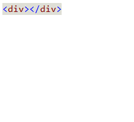
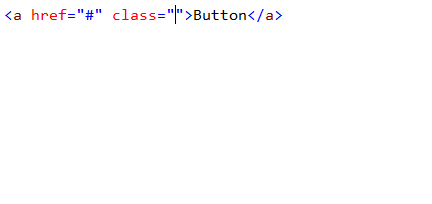
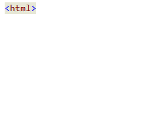

<properties
	pageTitle="Client-side"
	description="Visual Studio has excellent support for many types of client-side frameworks."
	slug="client-side"
	keywords="vsix, extensibility, plugins"
/>

## Angular.js
Full Intellisense for Angular's dependency injection system is supported,
as well as HTML properties and template bindings.

## React.js
coming soon...

## Bootstrap CSS
Visual studio makes it easy to identify what classes are coming from the 
[Bootstrap](http://getbootstrap.com) CSS framework by showing the logo in
the completion list.

## Aurelia
The [Web Essentials](http://vswebessentials.com) extension provides 
Intellisense for [Aurelia](http://aurelia.io/)'s HTML properties.

## Knockout.js
Get full Intellisense for your Knockout view models in the
HTML data binding expressions.

## Others

1. Backbone
2. Durandal
3. Ionic
4. Ember
5. Breeze
6. ...and many more