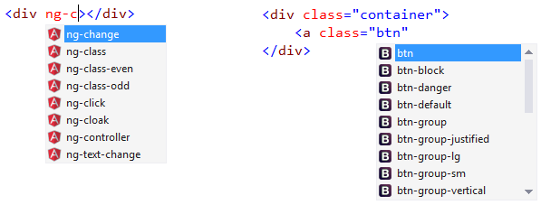

<properties
	pageTitle="Frameworks"
	description="A large number of both clint- and server-side frameworks have first-class support in Visual Studio."
	slug="frameworks"
	order="300"
	keywords="angular, jsx, bootstrap, reactjs, asp.net, django, express"
/>

Choose your frameworks or mix and match. Visual Studio includes 
Intellisense for your client-side JavaScript and also lights up 
with advanced support for today's most popular web frameworks 
like Angular and Bootstrap.