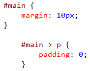

<properties
			pageTitle="CSS"
			description="The new CSS editor in Visual Studio fully supports all versions of CSS including CSS Selectors Level 4."
			slug="css"
			order="400"
			keywords="css, intellisense, stylesheets"
/>

## Basic auto-completion
The always-up-to-date web standards in Visual Studio provides a
fast and precise auto-completion experience.

## Advanced auto-completion
The Intellisense engine provides accurate auto-completion for
classes, IDs and attribute names and values, which can sometimes
be hard to remember.

## Vendor specific properties
The vendor specific selectors and properties are hidden until you
type a hyphen. Vendor specific definitions are supported for `-moz-*`, 
`-ms-*`, `-o-*` and `-webkit-*`.

## General snippets
The comprehensive snippet collection makes it easier to write more
complex CSS, like gradients, media queries, font-face embedding 
and a lot more.

To invoke a snippet, simply hit the `Tab` key after the property name.

## Vendor specific snippets
All properties that have vendor specific versions are automatically
provided as snippets. Just hit `Tab` to expand the snippet.

## Working with colors
coming soon...

## File picker
Working with images, fonts and other files is very easy using
the built-in file picker that automatically helps you type file
paths in CSS documents.

## Hierarchical indentation
Keep your CSS file nice and organized using hierarchical indentation.

The indentation of the CSS rulesets are based on the cascading order
of the selectors. Just format the document using `Ctrl+K+D` to
hierarchical indent cascading rulesets.

## Auto-sync with BrowserLink
coming soon...

## Open source
The entire CSS language definition that Visual Studio uses is open source.
Find a missing property or psuedo-selector? Send a pull request.