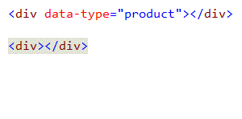

<properties
	pageTitle="HTML"
	description="The HTML editor was completely rewritten in Visual Studio 2013 to create a foundation for a constantly evolving editing experience."
	slug="html"
	order="100"
	keywords="html, intellisense, html5, xhtml, autocomplete"
/>

## Basic auto-completion
The HTML editor's up-to-date web standards definitions provides
accurate and fast Intellisense for all elements, attribute- names and values.

## Match end-tag
Never let your tags get out of sync again when editing. 
Visual Studio makes sure to always keep them in sync.

## Classes and IDs
It's easy to forget the names of classes and IDs so Visual Studio
gives you easy access to any class name or ID specified in the 
current document or from any stylesheet in your project.

## Dynamic data attributes
When using `data-*` attributes in HTML 5 to store custom data, it can be
difficult to remember the various attribute names and their values.

Visual Studio automatically keeps track of your `data-*` attributes and
gives Intellisense for both the attribute name and the previously used
values.

## Wrap with tag
Be more productive by using this handy shortcut to wrap the selection
with any element of your choice.

Simply hit `Shift+Alt+W` to wrap the selection.

## Snippets
Snippets provides a shortcut for common, but perhaps more complex elements.
There are snippets available for `<video>`, `<audio>`, `<picture>` and 
a lot more. You can add your own as well.

## File picker
The file picker gives you quick access to the files in your project.

It's smart enough to know what files you would typically use for
``, `<a>`, `<script>`, `<source>` and `<link>` elements, so it automatically
filters the list to only show those file types.

## HTML 5 Microdata
It's important to be very accurate when dealing with 
[Microdata](http://html5doctor.com/microdata/). 

Visual Studio helps you
to avoid typos, by giving Intellisense for the most common Microdata
vocabularies.

## ARIA attributes
Both ARIA Landmarks such as the `role` attribute, as well as `aria-*`
attributes are fully supported by Intellisense.

## HTML entities
Get quick and easy access to all those HTML entities that are so hard
to remember.

## Template syntax
Whether you use Mustache, Handlebars, Angular or any other doube-curly 
based template language, Visual Studio gives you nice colorization.

## Quick actions
Light bulbs show up variuos places in the document to give quick access
to various refactorings and helpers.

