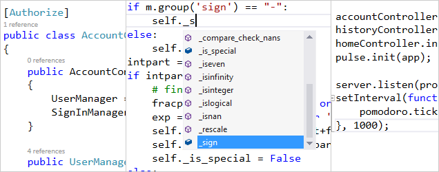

<properties
	pageTitle="Languages"
	description="Visual Studio has support for a wide variety of languages for targeting both the server and client."
	order="200"
	slug="languages"
	keywords="css, html, javascript"
/>

Use the language that makes you happy and productive. 
Move between languages and project-types with ease using 
the best HTML5, CSS3, and JavaScript editor in the world. 

Tap into the power of LESS, and SASS so front-end developers can 
join in the fun. 