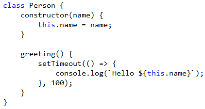

<properties
			pageTitle="JavaScript"
			description="The new JavaScript editor in Visual Studio supports EcmaScript 6 and has the most advanced Intellisense engine on the market."
			slug="javascript"
			order="300"
			keywords="javascript, jscript, script, dhtml, es3, es5, es6"
/>

## Basic auto-completion
The JavaScript Intellisense engine is powered by Internet Explorer's JavaScript
execution engine, Chakra. 

That means that all your JavaScript code is executed in the background to 
provide the ultimate Intellisense experience.

## EcmaScript 6 support
Visual Studio supports a broad set of EcmaScript 6 features including classes,
let, const, fat arrows and template strings.

## Object literal Intellisense
The Chakra execution engine is capable of reverse engineering function
parameters to provide object literal Intellisense.

## Snippets
Snippets provides a shortcut for common, but perhaps more complex structures,
which is a huge productivity boost.

## Go to definition
Ever needed to find the definition of a variable or function? By pressing `F12`
you can easily jump to the definition of any identifier - even across files.

## JSDoc support
The Intellisense engine supports JSDoc v3 as well as the older XMLDoc 
comment syntax.

## Debugging
Set breakpoints, watch locals and everything else you would expect
from a first-class debugging experience.

## Navigation bar
Easily get an overview of the functions and scopes in any JavaScript file
by using the navigation bar at the top of the editor.

## Unit testing
Chutzpah (hutz·pah) is an open source JavaScript unit test runner which 
helps you integrate JavaScript unit testing into your website. It enables 
you to run JavaScript unit tests from the command line and from inside of 
Visual Studio. 

It also supports running in the TeamCity continuous integration 
client. Chutzpah supports both the QUnit, Jasmine and Mocha testing frameworks

<aside role="complementary">

## Related resources

<section>

### More information

- [JSDoc v3](http://usejsdoc.org/)
- [XMLDoc comments](https://msdn.microsoft.com/en-us/library/bb514138.aspx)
- [Chutzpah on GitHub](https://github.com/mmanela/chutzpah/)
</section>

<section>

### Relevant extensions

- [Web Essentials](https://visualstudiogallery.msdn.microsoft.com/ee6e6d8c-c837-41fb-886a-6b50ae2d06a2)
- [JSLint](https://visualstudiogallery.msdn.microsoft.com/ede12aa8-0f80-4e6f-b15c-7a8b3499370e)
- [DocStubJs](https://visualstudiogallery.msdn.microsoft.com/0cb7304b-ad78-4283-ba2b-42804657fcdd)
- [Download Chutzpah Test Adapter](https://visualstudiogallery.msdn.microsoft.com/f8741f04-bae4-4900-81c7-7c9bfb9ed1fe)
- [Download Chutzpah Context Menu](https://visualstudiogallery.msdn.microsoft.com/71a4e9bd-f660-448f-bd92-f5a65d39b7f0)
</section>

</aside>