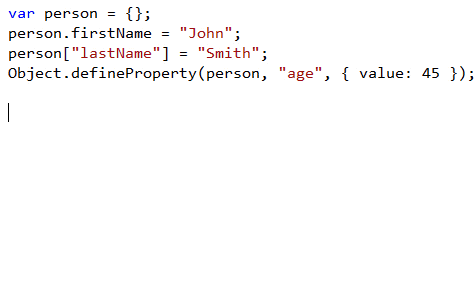
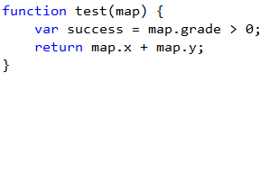
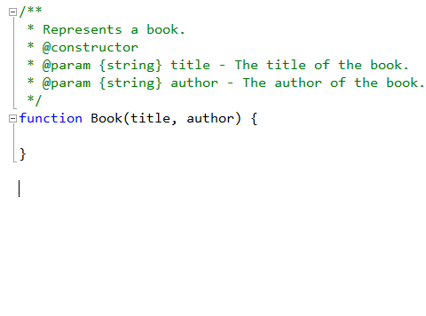
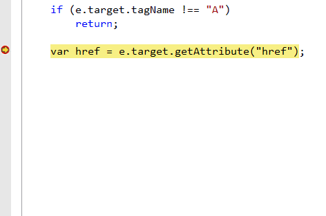
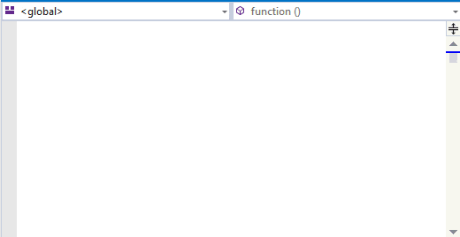

<properties
			pageTitle="JavaScript"
			description="Short description of the page"
			slug="javascript"
			order="300"
			keywords="javascript, jscript, script, dhtml, es3, es5, es6"
/>

## Basic auto-completion
The JavaScript Intellisense engine is powered by Internet Explorer's JavaScript
execution engine, Chakra. 

That means that all your JavaScript code is executed in the background to 
provide the ultimate Intellisense experience.

## EcmaScript 5 and 6 support
coming soon...

## Object literal Intellisense
The Chakra execution engine is capable of reverse engineering function
parameters to provide object literal Intellisense.

## Snippets
Snippets provides a shortcut for common, but perhaps more complex structures,
which is a huge productivity boost.

## Go to definition
coming soon...

## JSDoc support
The Intellisense engine supports [JSDoc v3](http://usejsdoc.org/) as well
as the older [XMLDoc comment](https://msdn.microsoft.com/en-us/library/bb514138.aspx) 
syntax.

## Debugging
Set breakpoints, watch locals and everything else you would expect
from a first-class debugging experience.

## Navigation bar
Easily get an overview of the functions and scopes in any JavaScript file
by using the navigation bar at the top of the editor.

## Unit testing
coming soon...