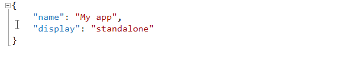
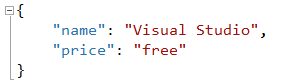
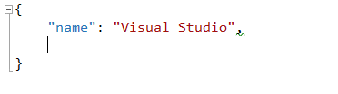

<properties
			pageTitle="JSON"
			description="The brand new JSON editor in Visual Studio is the first of its kind to fully support JSON Schema."
			slug="json"
			keywords="json, jsonp, javascript object notation"
/>

## Basic auto-completion
Writing JSON documents has never been easier and more fluent than
with the Visual Studio JSON editor.

You can even type the colon inside the property name to boost your
productivity.

## JSON Schema draft v4
coming soon...

## Schema based Intellisense
By leveraging JSON Schema it is now easier than ever to work with JSON
documents.

This example shows how it's like working with a 
[Web Manifest](http://www.w3.org/TR/appmanifest/) JSON document.

## For schema authors
Intellisense for $ref, $schema, required etc.

coming soon...

## Tooltips
Information from the referenced JSON Schema is displayed as hover tooltips
to help make it clear what the various properties mean.

## Code navigation
1. Go to $schema definition
2. Go to $ref definition

## Open source
The entire CSS language definition that Visual Studio uses is open source.
Find a missing property or psuedo-selector? Send a pull request.

## Comments
Most modern JSON parsers supports comments and so does Visual Studio.

Simply hit the global keyboard shortcut `Ctrl+K+C` to add a comment
or `Ctrl+K+U` to uncomment the line or selection.

## Validation
The editor helps you keep track of both syntax errors as well as
other potential issues, such as duplicate properties.

## Quick actions
sort properties

coming soon...