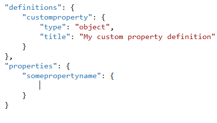
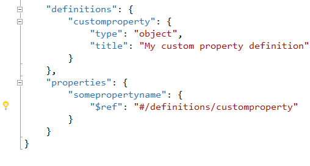

<properties
			pageTitle="JSON"
			description="The brand new JSON editor in Visual Studio is the first of its kind to fully support JSON Schema."
			slug="json"
			keywords="json, jsonp, javascript object notation"
/>

## Basic auto-completion
Writing JSON documents has never been easier and more fluent than
with the Visual Studio JSON editor.

You can even type the colon inside the property name to boost your
productivity.

## JSON Schema draft v4
The JSON editor in Visual Studio is the first of its kind to fully
support the [JSON Schema](http://json-schema.org) standard.

This results in Intellisense and validator for some of the most common
JSON file formats. 

## Schema based Intellisense
By leveraging JSON Schema it is now easier than ever to work with JSON
documents.

This example shows how it's like working with a 
[Web Manifest](http://www.w3.org/TR/appmanifest/) JSON document.

## Tooltips
Information from the referenced JSON Schema is displayed as hover tooltips
to help make it clear what the various properties mean.

## Comments
Most modern JSON parsers supports comments and so does Visual Studio.

Simply hit the global keyboard shortcut `Ctrl+K+C` to add a comment
or `Ctrl+K+U` to uncomment the line or selection.

## Validation
The editor helps you keep track of both syntax errors as well as
other potential issues, such as duplicate properties.

## For JSON Schema authors
You get great support for writing JSON Schema documents.

### JSON Pointers
Visual Studio provides full Intellisense for
[JSON Pointer](http://tools.ietf.org/html/rfc6901) references.

It works both for pointers in the current document as well as remote
references.

### Inline $ref references
Get help refactoring your JSON Schema by easily inlining any
`$ref` references.

### Go to definition
You can hit `F12` on any `$ref` or `$schema` property to navigate
to its source origin - in both local and remote file.

### Open source
All the JSON Schema files that provide Intellisense and validation is open
source at [SchemaStore.org](http://schemastore.org)

<aside role="complementary">

## Related resources

<section>

### More information

- [JSON-Schema.org](http://json-schema.org)
- [SchemaStore.org](http://schemastore.org)
- [Understanding JSON Schema](http://spacetelescope.github.io/understanding-json-schema/)
</section>

<section>

### Relevant extensions

- [Web Essentials](https://visualstudiogallery.msdn.microsoft.com/ee6e6d8c-c837-41fb-886a-6b50ae2d06a2)
- [JSON Schema Generator](https://visualstudiogallery.msdn.microsoft.com/b4515ef8-a518-41ca-b48c-bb1fd4e6faf7)
</section>

</aside>