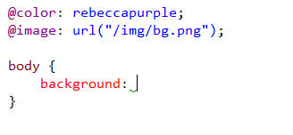
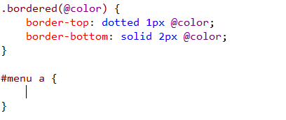

<properties
    pageTitle="LESS & Sass"
    description="The two most popular supersets of CSS are fully supported. The support covers everything the CSS editor offers + some additional features."
    slug="less-sass"
    order="400"
    keywords="css, intellisense, stylesheets"
/>

## Variables
Quickly access your variable from the current document or any imported
files. The tooltip shows the value of each variable so you don't have
to guess.

## Mixins
The editor provides both Intellisense and tooltips for mixins in the
same file as well as across imported files.

