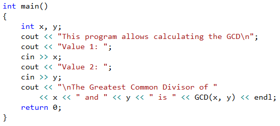
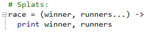
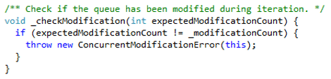
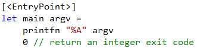
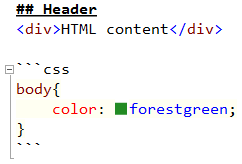
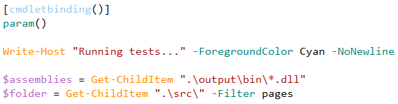
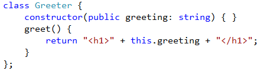
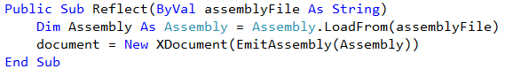

<properties
    pageTitle="Other languages"
    description="Visual Studio provides support for a wide variety of languages and technologies - either built in or as extensions."
    slug="other"
    order="1500"
    keywords="css, intellisense, stylesheets"
/>

## C++
use the powerful and flexible Visual C++ language, with the tools 
to enable the development of native Windows apps, native desktop apps, 
and managed apps that run on the .NET Framework.

## CoffeeScript
Syntax highlighting and code folding is supported in the built-in
CoffeeScript editor. This includes support for IcedCoffeeScript.

## Dart
This [DartVS](https://visualstudiogallery.msdn.microsoft.com/69112f14-62d0-40fb-9ccc-03e3534e7121)
extension gives syntax highlighting and compiler errors directly
inside Visual Studio.

## F#
Support for F# is built in to Visual Studio, but you get even
more features by installing the free
[F# Power Tools](https://visualstudiogallery.msdn.microsoft.com/136b942e-9f2c-4c0b-8bac-86d774189cff)
extension.

## Markdown
The free [Web Essentials](https://visualstudiogallery.msdn.microsoft.com/ee6e6d8c-c837-41fb-886a-6b50ae2d06a2)
extension provides a full featured Markdown editor based on CommonMark.

It also shows a preview window of the rendered output and supports code
blocks and inline HTML.

- [Download Web Essentials](https://visualstudiogallery.msdn.microsoft.com/ee6e6d8c-c837-41fb-886a-6b50ae2d06a2)
- [Web Essentials on GitHub](https://github.com/madskristensen/webessentials2015/)

## Node.js
NTVS is a free, open source plugin that turns Visual Studio into a Node.js IDE. 

NTVS supports Editing, Intellisense, Profiling, npm, TypeScript, Debugging locally 
and remotely (Windows/MacOS/Linux), as well Azure Web Sites and Cloud Service.

Designed, developed, and supported by Microsoft and the community.

- [Download Node Tools on Codeplex](http://nodejstools.codeplex.com/)

## PHP
PHP Tools transparently integrate into Microsoft Visual Studio, and extend it 
with the support for PHP language. The extension is focused on developer 
productivity respecting conventions. 

It understands your code, provides smart 
code completion, quick navigation, syntax error checking, integrated PHP manual, 
project system, debugging support and more.

- [Download PHP Tools](https://visualstudiogallery.msdn.microsoft.com/6eb51f05-ef01-4513-ac83-4c5f50c95fb5)

## PowerShell
Windows PowerShell® is a task-based command-line shell and scripting language 
designed especially for system administration. Built on the .NET Framework, 
Windows PowerShell helps IT professionals and power users control and automate the 
administration of the Windows operating system and applications that run on Windows.

## Python
Python Tools for Visual Studio includes full support for the Djano
web framework.

- [Download Python Tools](https://visualstudiogallery.msdn.microsoft.com/9ea113de-a009-46cd-99f5-65ef0595f937)
- [Python Tools on Codeplex](http://pytools.codeplex.com/)

## TypeScript
TypeScript lets you write JavaScript the way you really want to.
TypeScript is a typed superset of JavaScript that compiles to plain JavaScript.

Visual Studio includes TypeScript in the box, starting with 
Visual Studio 2013 Update 2.

## Visual Basic .NET
A language engineered for productively building type-safe and object-oriented 
applications, for both the beginner and the experienced developer.

## YAML
A YAML editor is provided by the free extension
[YAML Editor](https://visualstudiogallery.msdn.microsoft.com/34423c06-f756-4721-8394-bc3d23b91ca7).

It gives syntax highlighting, error detection, formatting and more...

- [Download YAML Editor](https://visualstudiogallery.msdn.microsoft.com/34423c06-f756-4721-8394-bc3d23b91ca7)
- [YAML Editor on GitHub](https://github.com/aaubry/YamlDotNet.Editor/)

<aside role="complementary">

## Related resources

<section>

### More information

- [Django in Visual Studio](http://www.hanselman.com/blog/OneOfMicrosoftsBestKeptSecretsPythonToolsForVisualStudioPTVS.aspx)
- [Introduction to Node Tools](http://www.hanselman.com/blog/IntroducingNodejsToolsForVisualStudio.aspx)
- [PHP Tools website](http://www.devsense.com/products/php-tools/)
</section>

</aside>