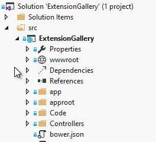
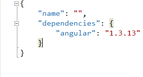

<properties
	pageTitle="Bower"
	description="The best-in-class Bower support makes it easier than ever to use Bower components in your projects."
	slug="bower"
	keywords="bower, packages, bowerjs"
/>

## bower.json Intellisense
Get full Intellisense for everything in bower.json including live
search results from the online Bower registry.

## Install on save
As soon as you save any changes to the `bower.json` file, Visual Studio
will automatically call `bower install` to install or restore all packages.

## IDE integration
The Solution Explorer integrates with Bower to show a logical treeview
structure of the package dependencies.

## Light bulbs
Perform common tasks on individual packages using the light bulbs that
automatically appears next to each package.

## Automatic removal of BOM
To make sure that Bower is always able to read the bower.json file,
Visual Studio automatically strips the Byte Order Mark (BOM) when
the file is saved.

<aside role="complementary">

## Related resources

<section>

### More information

- [Bower website](http://bower.io/)
- [Getting started](http://bower.io/#getting-started)
</section>

<section>

### Relevant extensions

- [Grunt Launcher](https://visualstudiogallery.msdn.microsoft.com/dcbc5325-79ef-4b72-960e-0a51ee33a0ff)
- [Package Intellisense](https://visualstudiogallery.msdn.microsoft.com/65748cdb-4087-497e-a394-2e3449c8e61e)
</section>

</aside>