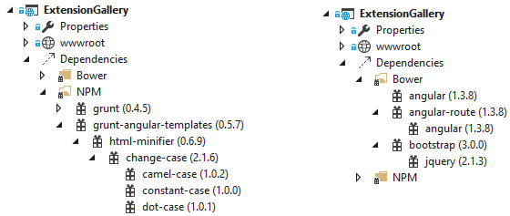

<properties
	pageTitle="Package Managers"
	description="Visual Studio provides first-class support for 3 great package managers - Bower, NuGet and npm."
	slug="package-managers"
	order="400"
	keywords="css, html, javascript"
/>

Join the Open Web and pull in libraries from all over. 

NuGet offers rich .NET server-side libraries, integration with 
the bower package manager connects you to the latest thinking in 
client side JavaScript technology, and npm pulls in great tools 
and utlities.

