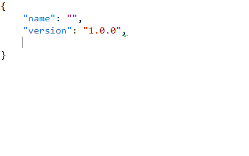
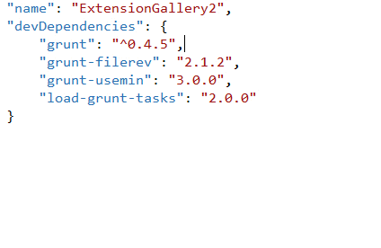
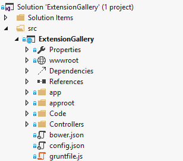
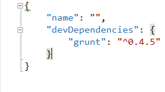

<properties
	pageTitle="npm"
	description="The Node Package Manager is fully integrated with Visual Studio to provide a more natural user workflow."
	slug="npm"
	keywords="npm, node, nodejs, node package manager"
/>

## package.json Intellisense
Get full Intellisense for everything in package.json including live
search results from the online npm registry.

## Tooltip
Easily glance at the different properties associated with each package
by hovering the mouse over the name of the dependency.

## Install on save
As soon as you save any changes to the `package.json` file, Visual Studio
will automatically call `npm install` to install or restore all packages.

## IDE integration
The Solution Explorer integrates with npm to show a logical treeview
structure of the package dependencies.

## Light bulbs
Perform common tasks on individual packages using the light bulbs that
automatically appears next to each package.

## Automatic removal of BOM
To make sure that npm is always able to read the package.json file,
Visual Studio automatically strips the Byte Order Mark (BOM) when
the file is saved.

<aside role="complementary">

## Related resources

<section>

### More information

- [npm website](https://www.npmjs.com/)
- [npm documentation](https://docs.npmjs.com/)
</section>

<section>

### Relevant extensions

- [Grunt Launcher](https://visualstudiogallery.msdn.microsoft.com/dcbc5325-79ef-4b72-960e-0a51ee33a0ff)
- [Package Intellisense](https://visualstudiogallery.msdn.microsoft.com/65748cdb-4087-497e-a394-2e3449c8e61e)
</section>

</aside>