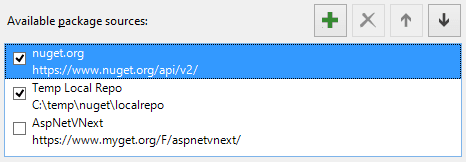

<properties
	pageTitle="NuGet"
	description="The NuGet package manager is ideal for .NET components. With Visual Studio 2015 it is more powerful than ever."
	slug="nuget"
    order="300"
	keywords="nuget, myget"
/>

## project.json Intellisense
Get full Intellisense for everything in project.json including live
search results from the online [NuGet registry](http://nuget.org).

project.json is used to configure CoreCLR and ASP.NET 5 applications.

## Full package management system
coming soon...

## Multiple sources
Add any local or remote package source through the built-in NuGet
settings dialog.

