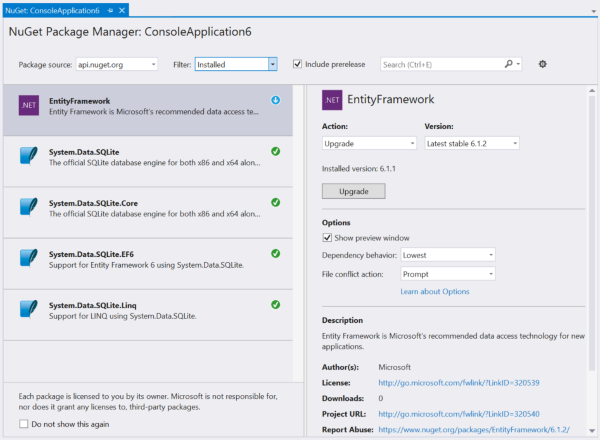
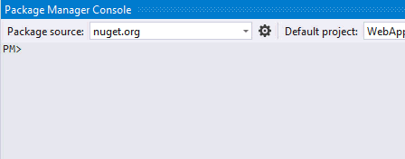
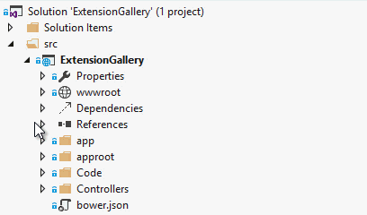

<properties
	pageTitle="NuGet"
	description="The NuGet package manager is ideal for .NET components. With Visual Studio 2015 it is more powerful than ever."
	slug="nuget"
    order="300"
	keywords="nuget, myget, packages"
/>

## project.json Intellisense
Get full Intellisense for everything in project.json including live
search results from the online [NuGet registry](http://nuget.org).

project.json is used to configure CoreCLR and ASP.NET 5 applications.

## Graphical package management experience
NuGet provides a graphical interface for managing packages. This allows you
to very easily get an overview over installed packages, doing updates and
discover new useful packages for your project. 

## Package Manager Console
You can use PowerShell with NuGet and with the Package Manager Console it's
now possible to take the PowerShell experience into Visual Studio.

## IDE integration
The Solution Explorer integrates with NuGet to show a logical treeview
structure of the package dependencies.

## Multiple sources
Add any local or remote package source through the built-in NuGet
settings dialog.

<aside role="complementary">

## Related resources

<section>

### More information

- [NuGet.org](http://nuget.org/)
- [Consume NuGet packages](https://docs.nuget.org/consume)
- [Create NuGet packages](http://docs.nuget.org/create/Creating-and-Publishing-a-Package)
</section>

<section>

### Relevant extensions

- [NuGet Packager](https://visualstudiogallery.msdn.microsoft.com/daf5c6db-386b-4994-bdd7-b6cd52f11b72)
- [NuGet References](https://visualstudiogallery.msdn.microsoft.com/e8d1fcad-5fa5-4353-ba9c-90f4b6a68154)
</section>

</aside>