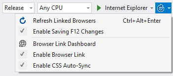

<properties
	pageTitle="Browser Link"
	description="Visual Studio creates a bi-directional web socket channel to any browser or emulator. That socket is called Browser Link."
	slug="browser-link"
	keywords="browserlink, web socket, browsersync"
/>

## JavaScript and Web Sockets
Browser Link is a bi-directional communication channel between Visual
Studio and any browser or emulator. It's based on JavaScript and 
Web Sockets.

This channel allows messages and commands to be sent from Visual Studio
to the browser, such as to reload the page or update the CSS rules.

But it can also work the other way so that the browsers can interact
with Visual Studio.

## Refresh page
coming soon...

## CSS Auto Sync
coming soon...

## Internet Explorer integration
coming soon...