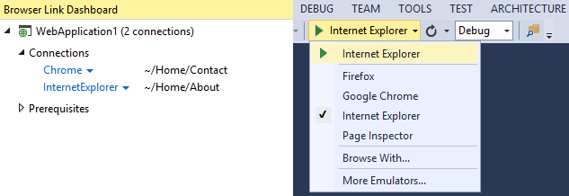

<properties
	pageTitle="Project system"
	description="The project system is the backbone of any web project in Visual Studio."
	slug="project-system"
	order="600"
	keywords="css, html, javascript"
/>

Be more productive with the brand new web project system, 
with simple folder based structure that automatically 
updates the browsers when the code changes.

