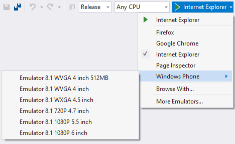

<properties
	       pageTitle="Projects"
	       description="Visual Studio creates a bi-directional web socket channel to any browser or emulator. That socket is called BrowserLink."
	       slug="projects"
           order="100"
	       keywords="browserlink, web socket, browsersync"
/>

## Folder based web projects
coming soon...

## Run/debug profiles
coming soon...

## Browser support
Select your browser of choice from a dropdown menu and start running
and debugging your app. 

Visual Studio provides both Windows Phone and Android emulators,
but you can install a lot more such as iOS emulators etc.

