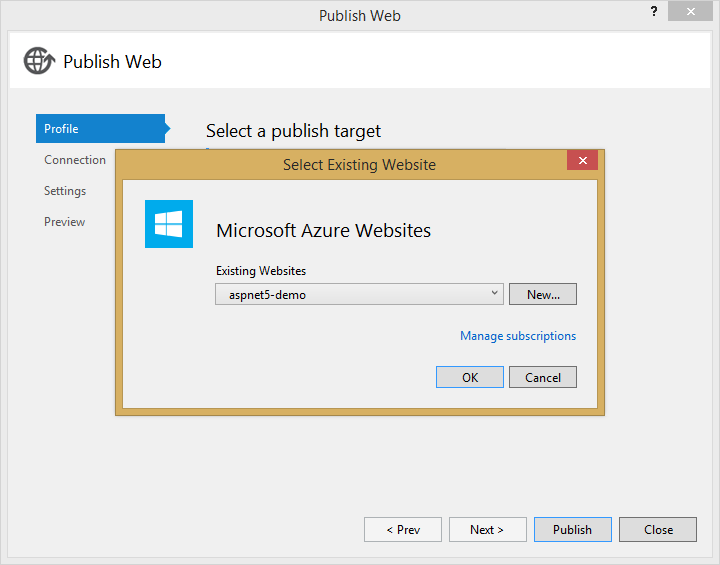
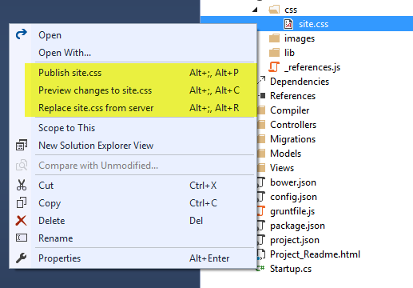

<properties
	pageTitle="Publishing"
	description="Publishing was written from the ground up for ASP.NET 5, to make publishing much easier to understand and extend."
	slug="publishing"
	keywords="css, html, javascript"
/>

## Azure Websites
Publishing to Azure Websites has first class support in Visual Studio 2015.
You can easily publish to a new or existing site within seconds.

## File system
You can publish to a local or network folder easily from Visual Studio
as well.

## Incremental publishing
After creating a publish profile you can easily publish one or more
files directly from Solution Explorer. You can also preview changes
before publishing or even download remote files.

## Customizing publishing
For ASP.NET 5 we have created a new publishing system which
is based on PowerShell. This makes is much easier for you to customize
your publish process. When you create a publish profile a PowerShell
script is added to your project. That is the script that Visual Studio
will execute after calling kpm bundle to package the application.
When the Visual Studio publish process starts the script will be called
after the projcet is packed.