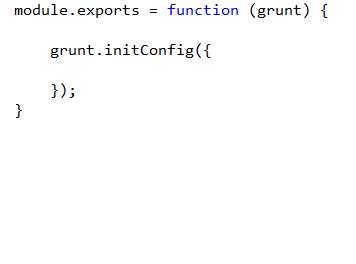
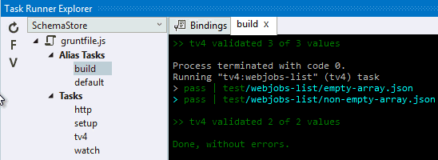
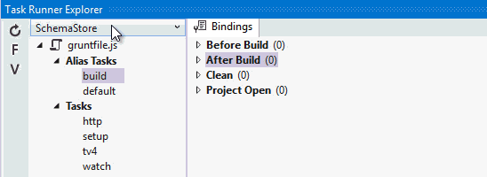

<properties
	pageTitle="Grunt"
	description="Visual Studio has first-class support for the node.js based Grunt task runner."
	slug="grunt"
	keywords="grunt, gruntjs, grunt.js, task runner"
/>

## Intellisense for gruntfile.js
You get auto-completion for the `grunt` object as well as for the
configuration of the variuos different Grunt tasks.

## Snippets
Create a new gruntfile.js very easily using the built-in snippet provided
by the JavaScript editor.

Expand the snippet by typing `grunt` and hitting `Tab`.

## Task Runner Explorer
Use Visual Studio's Task Runner Explorer window to interact with Grunt.

Get an overview of your tasks and execute them directly from within
Visual Studio.

## Custom task bindings
Incorporate Grunt tasks into your natural workflow by associating your task
with Visual Studio events.

<aside role="complementary">

## Related resources

<section>

### More information

- [Grunt website](http://gruntjs.com/)
- [Managing your build tasks](http://code.tutsplus.com/tutorials/managing-your-build-tasks-with-gulpjs--net-36910)
</section>

<section>

### Relevant extensions

- [Web Essentials](https://visualstudiogallery.msdn.microsoft.com/ee6e6d8c-c837-41fb-886a-6b50ae2d06a2)
- [Grunt Launcher](https://visualstudiogallery.msdn.microsoft.com/dcbc5325-79ef-4b72-960e-0a51ee33a0ff)
</section>

</aside>