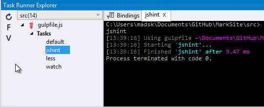
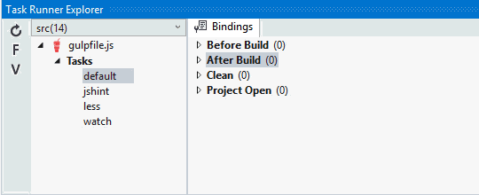

<properties
	pageTitle="Gulp"
	description="Visual Studio has first-class support for the node.js based Gulp task runner."
	slug="gulp"
	keywords="gulp, gulpjs, gulp.js, task runner"
/>

## Intellisense for gulpfile.js
The JavaScript editor provides a great editing experience when it comes
to Gulp. 

You get full Intellisense for Gulp as well as other Node.js modules
used in your gulpfile.js.

Using the [Web Essentials](http://vswebessentials.com) extension
you also get completion for loading node modules.

## Task Runner Explorer
Use Visual Studio's Task Runner Explorer window to interact with Gulp.

Get an overview of your tasks and execute them directly from within
Visual Studio.

## Custom task bindings
Incorporate Gulp tasks into your natural workflow by associating your task
with Visual Studio events.

<aside role="complementary">

## Related resources

<section>

### More information

- [Gulp website](http://gulpjs.com/)
- [Managing your build tasks](http://code.tutsplus.com/tutorials/managing-your-build-tasks-with-gulpjs--net-36910)
</section>

<section>

### Relevant extensions

- [Web Essentials](https://visualstudiogallery.msdn.microsoft.com/ee6e6d8c-c837-41fb-886a-6b50ae2d06a2)
- [Grunt Launcher](https://visualstudiogallery.msdn.microsoft.com/dcbc5325-79ef-4b72-960e-0a51ee33a0ff)
- [Task Runner Explorer](https://visualstudiogallery.msdn.microsoft.com/8e1b4368-4afb-467a-bc13-9650572db708)
</section>

</aside>